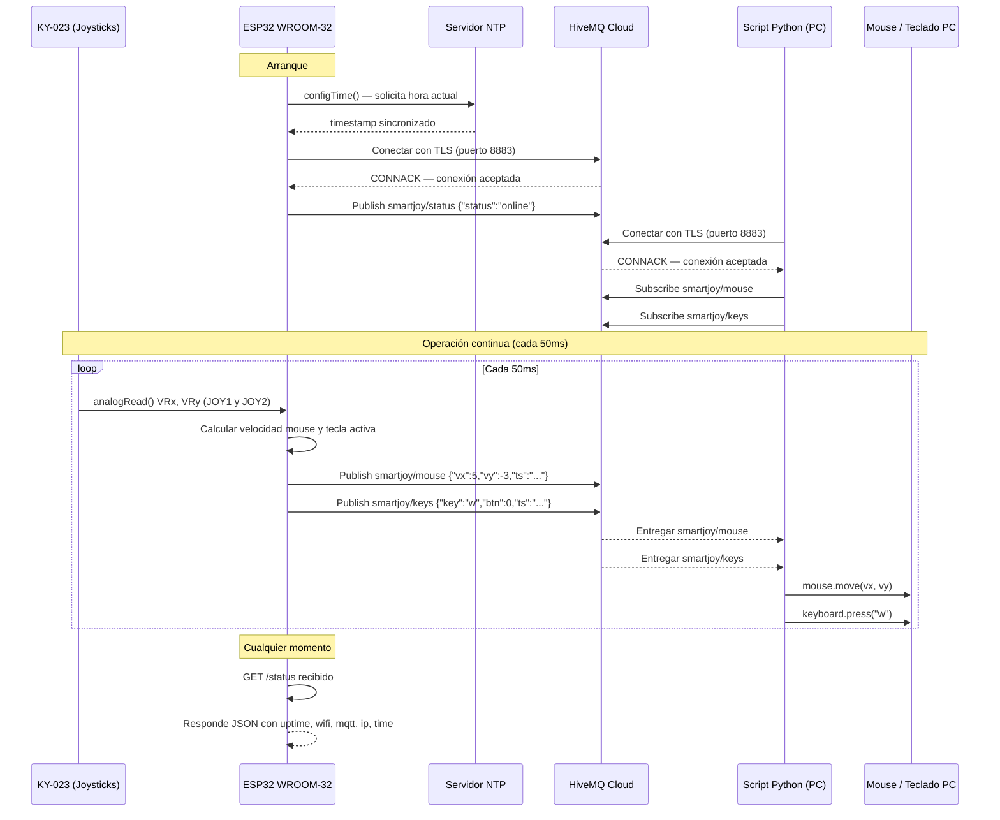

# Proyecto-IOT---Documentacion-Final
# SmartJoy — Joystick Inalámbrico IoT

Control inalámbrico de mouse y teclado mediante dos joysticks KY-023 y un ESP32, comunicados por MQTT con cifrado TLS a través de HiveMQ Cloud. Un script Python en la PC traduce los mensajes del broker en movimientos reales de mouse y pulsaciones de teclado.

---

## Demo


## ¿Cómo funciona?

```
[KY-023 #1]  →  ESP32  →  MQTT/TLS  →  HiveMQ Cloud  →  Python  →  Mouse PC
[KY-023 #2]  →  ESP32  →  MQTT/TLS  →  HiveMQ Cloud  →  Python  →  Teclado PC
```

- **JOY1** controla el movimiento del mouse (ejes X/Y)
- **JOY2** controla las teclas WASD + Enter
- El ESP32 publica los datos cada 50ms al broker MQTT
- Un script Python en la PC los recibe y ejecuta las acciones correspondientes

---

## Arquitectura

```
┌─────────────────────────────────┐
│         UNIDAD TRANSMISORA      │
│                                 │
│  [KY-023 #1] ──→               │
│  [KY-023 #2] ──→  ESP32        │
│                   WROOM-32      │
│                   + NTP         │
│                   + /status     │
└──────────────┬──────────────────┘
               │ Wi-Fi / MQTT TLS
               │ Puerto 8883
               ▼
┌─────────────────────────────────┐
│       HiveMQ Cloud (Broker)     │
│   902c9c7...hivemq.cloud        │
└──────────────┬──────────────────┘
               │
               ▼
┌─────────────────────────────────┐
│         PC — Script Python      │
│                                 │
│  paho-mqtt  →  pynput           │
│  (recibe)   →  (mouse/teclado)  │
└─────────────────────────────────┘
```

---

## Tópicos MQTT

| Tópico | Acción | Descripción | Payload ejemplo |
|---|---|---|---|
| `smartjoy/mouse` | Publica | Velocidad del mouse en X e Y | `{"vx":5,"vy":-3,"ts":"2026-05-27T10:00:00"}` |
| `smartjoy/keys` | Publica | Tecla activa y estado del botón | `{"key":"w","btn":0,"ts":"2026-05-27T10:00:00"}` |
| `smartjoy/status` | Publica | Estado de conexión del ESP32 | `{"status":"online"}` |

---

## Endpoint API — Healthcheck

El ESP32 expone un servidor HTTP en el puerto 80 para verificar su estado.

### `GET /status`

**URL:** `http://<IP_DEL_ESP32>/status`

**Respuesta exitosa (200):**
```json
{
  "status": "ok",
  "uptime_s": 120,
  "wifi": "connected",
  "mqtt": "connected",
  "ip": "192.168.x.x",
  "time": "2026-05-27T10:35:00"
}
```

---

## Hardware

| Componente | Cantidad | Función |
|---|---|---|
| ESP32 WROOM-32 DevKit | 1 | Microcontrolador principal |
| KY-023 Dual-Axis Joystick | 2 | Sensor de entrada |
| Protoboard | 1 | Conexiones |
| Cables jumper | — | Cableado |

### Diagrama de pines

| KY-023 #1 (Mouse) | Pin ESP32 |
|---|---|
| VCC | 3.3V |
| GND | GND |
| VRx | GPIO 34 |
| VRy | GPIO 35 |

| KY-023 #2 (Teclado) | Pin ESP32 |
|---|---|
| VCC | 3.3V |
| GND | GND |
| VRx | GPIO 32 |
| VRy | GPIO 33 |
| SW | GPIO 25 |

> Usar siempre **3.3V**, nunca 5V. Los pines GPIO 34 y 35 son solo entrada.

---

## Cómo ejecutar el proyecto

### Requisitos previos
- Arduino IDE con soporte para ESP32 (Espressif)
- Python 3.x
- Cuenta en [HiveMQ Cloud](https://hivemq.com) (gratuita)
- Red Wi-Fi WPA2-Personal con acceso a internet (hotspot móvil recomendado)

### 1. Configurar el ESP32

Instalar la librería **PubSubClient** de Nick O'Leary desde el gestor de librerías de Arduino IDE.

Abrir `firmware/smartjoy_main.ino` y configurar las credenciales:

```cpp
const char* ssid     = "TU_RED_WIFI";
const char* password = "TU_PASSWORD";

const char* mqtt_server   = "TU_HOST.hivemq.cloud";
const char* mqtt_username = "TU_USUARIO";
const char* mqtt_password = "TU_PASSWORD_MQTT";
```

Cargar el sketch al ESP32.

### 2. Calibrar los joysticks

Al arrancar, **no tocar los joysticks durante 3 segundos** mientras el ESP32 calibra el centro real de cada eje. El Serial Monitor mostrará los valores calibrados.

### 3. Ejecutar el script Python

```bash
pip install paho-mqtt pynput
python scripts/smartjoy_client.py
```

El script se conecta al broker y comienza a controlar el mouse y el teclado en tiempo real.

---

## Uso de memoria (ESP32)

| Recurso | Usado | Disponible |
|---|---|---|
| Flash | — KB | 4096 KB |
| RAM | — KB | 520 KB |

---

## Librerías utilizadas

### ESP32 (C++)
| Librería | Fuente | Uso |
|---|---|---|
| `WiFi.h` | Core ESP32 | Conexión Wi-Fi |
| `WiFiClientSecure.h` | Core ESP32 | TLS para MQTT |
| `PubSubClient` 2.8 | Nick O'Leary | Cliente MQTT |
| `WebServer.h` | Core ESP32 | Endpoint /status |
| `time.h` | Core ESP32 | Sincronización NTP |

### Python
| Librería | Uso |
|---|---|
| `paho-mqtt` 2.x | Cliente MQTT |
| `pynput` 1.x | Control de mouse y teclado |

---

## Limitaciones

- El ESP32 WROOM-32 no soporta USB HID nativo, por lo que el control del mouse y teclado requiere un script Python corriendo en la PC.
- La red universitaria (WPA2-Enterprise) bloquea la conexión del ESP32. Se recomienda usar hotspot móvil.
- La sincronización NTP puede fallar en redes que bloqueen el puerto 123. En ese caso los timestamps se muestran como `"sin-hora"` pero el sistema sigue funcionando.
- La latencia depende de la calidad de la red Wi-Fi y puede aumentar en entornos con interferencia.

---

## Posibilidades de mejora

- Migrar a ESP32-S2 o S3 para soporte nativo de USB HID y eliminar la dependencia del script Python
- Agregar un display OLED en el transmisor para mostrar estado de conexión y batería
- Implementar modos de operación (velocidad alta, modo precisión) cambiables con el botón
- Agregar telemetría bidireccional para monitorear el estado desde el joystick
- Dashboard en Node-RED para visualizar los datos del broker en tiempo real
- Modo de ahorro de energía con deep sleep cuando el joystick está inactivo

---


## Diagrama de Secuencia



---

## Estructura del repositorio

```
smartjoy-iot/
├── README.md
├── DESARROLLO.md               ← Proceso de desarrollo y decisiones técnicas
├── firmware/
│   └── smartjoy_main/
│       └── smartjoy_main.ino   ← Sketch principal del ESP32
├── scripts/
│   └── smartjoy_client.py      ← Script Python para PC
├── hardware/
│   └── schematic.png           ← Diagrama de conexiones
└── docs/
    └── diagnostico_wifi.md     ← Guía de diagnóstico Wi-Fi
```

---

## Equipo

| Nombre | Rol |
|---|---|
| Daniel David Gomez Britto | Ensamble y Código |
| Juan Camilo Silva Velasco | Código y Pruebas |

**Universidad:** Universidad de La Sabana

---

## Referencias

- [Datasheet KY-023](https://arduinomodules.info/ky-023-joystick-dual-axis-module/)
- [ESP32 ADC Calibration — Espressif Docs](https://docs.espressif.com/projects/esp-idf/en/latest/esp32/api-reference/peripherals/adc_calibration.html)
- [HiveMQ Cloud — Free MQTT Broker](https://hivemq.com/mqtt-cloud-broker/)
- [PubSubClient — Nick O'Leary](https://pubsubclient.knolleary.net/)
- [paho-mqtt Python](https://eclipse.dev/paho/files/paho.mqtt.python/html/index.html)
- [pynput Documentation](https://pynput.readthedocs.io/)
